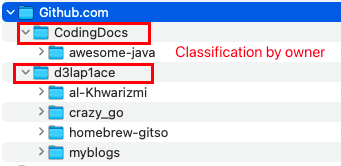
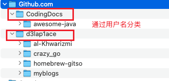

<p align="right">
  🌐 <a href="#english">English</a> | <a href="#中文">中文</a>
</p>
<a id="english"></a>

# gitso
 
> `gitso` is a CLI tool that clones any GitHub repository (HTTPS **or** SSH) and files it under a predictable tree by owner or domain name 
> `~/Documents/GitHub.com/<owner>/<repo>`.  
> If the host doesn’t have a system-wide `git`, it silently falls back to an embedded **go-git** engine, so it even works inside scratch containers and FaaS.

---

## Usage examples
      ```bash
      gitso git@github.com:d3Lap1ace/homebrew-gitso.git
      gitso https://github.com/d3Lap1ace/homebrew-gitso.git

      # clone into ~/Code
      gitso -d ~/Code git@github.com:d3Lap1ace/homebrew-gitso.git

      # clone dev branch
      gitso -b dev https://github.com/d3Lap1ace/homebrew-gitso.git
      ```

## Rendering


## Project motivation

| Pain point | gitso’s answer |
|------------|----------------|
| Repos scattered across random folders | Opinionated layout keeps everything under one root |
| Minimal containers / CI images lack `git` | Falls back to pure-Go implementation when `git` isn’t present |
| Keeping repos up-to-date | Detects existing repo → runs `git pull --ff-only` |
| Tedious `cd && git pull` before work | One command, no manual navigation |

---

## Installation

1. **Linux**<br>
    * **amd64**<br>
   Download `gitso_linux_amd64.tar.gz`
      ```bash
      tar -zxvf gitso_linux_amd64.tar.gz gitso \
      && cd gitso \
      && sudo chmod +x gitso \
      && sudo mv gitso/gitso /usr/local/bin \
      && gitso --help
      ```
    * **arm64**<br>
   Download `gitso_linux_arm64.tar.gz`
      ```bash
      tar -zxvf gitso_linux_arm64.tar.gz gitso \
      && cd gitso \
      && sudo chmod +x gitso \
      && sudo mv gitso/gitso /usr/local/bin \
      && gitso --help
      ```

2. **macOS**<br>
   Install via **Homebrew**  
   ```bash
   brew tap d3Lap1ace/gitso \
   && cd gitso \
   && brew install gitso \
   && gitso --help
   ```

3. **Windows**
    * **amd64**
        1. Download `gitso_windows_amd64.zip`
        2. Unzip `gitso.exe` into a directory on `%PATH%` (e.g. `C:\Tools\`)
        3. Open a new PowerShell / CMD and run `gitso --help`

> **Tips**  
> • Detect CPU arch: `uname -m` (Linux/macOS) / `wmic os get osarchitecture` (Windows)  
> • macOS requires removing quarantine tags when installing via platform binaries. <br>remove quarantine tags commend:`sudo xattr -d com.apple.quarantine /usr/local/bin/gitso`<br>
> • On macOS, Homebrew automatically removes the quarantine flag, so no extra steps are needed.  
> • All binaries are available on every GitHub Release page.
>
## Modify default settings
> `gitos config --dest <your file directory>`
---

<a id="中文"></a>

<p align="right">
  🌐 <a href="#english">English</a> | <a href="#中文">中文</a>
</p>

# gitso

> `gitso` 是一个 CLI 工具，可克隆任意 GitHub 仓库（HTTPS **或** SSH），根据域名作者名并将其按可预测的目录树存放到  
> `~/Documents/GitHub.com/<owner>/<repo>`。  
> 如果宿主环境没有系统级 `git`，它会自动回退到内嵌的 **go-git** 引擎，因此即使在 scratch 容器和 FaaS 中也能正常工作。

---

## 使用示例
      ```bash
      gitso git@github.com:d3Lap1ace/homebrew-gitso.git
      gitso https://github.com/d3Lap1ace/homebrew-gitso.git

      # clone into ~/Code
      gitso -d ~/Code git@github.com:d3Lap1ace/homebrew-gitso.git

      # clone dev branch
      gitso -b dev https://github.com/d3Lap1ace/homebrew-gitso.git
      ```

## 效果图


## 项目动机

| 痛点 | gitso 的解决方案 |
|------------|----------------|
| 仓库散落在随机文件夹 | 统一的根目录结构将所有仓库集中管理 |
| 最小化容器 / CI 镜像缺少 `git` | 当系统缺少 `git` 时，自动切换到纯 Go 实现 |
| 保持仓库最新 | 检测已存在仓库 → 执行 `git pull --ff-only` |
| 每次工作前需手动 `cd && git pull` | 一条命令，无需手动导航 |


---

## 安装

1. **Linux**<br>
    * **amd64**<br>
      下载 `gitso_linux_amd64.tar.gz`
      ```bash
      tar -zxvf gitso_linux_amd64.tar.gz gitso \
      && cd gitso \
      && sudo chmod +x gitso \
      && sudo mv gitso/gitso /usr/local/bin \
      && gitso --help
      ```
    * **arm64**<br>
      下载 `gitso_linux_arm64.tar.gz`
      ```bash
      tar -zxvf gitso_linux_arm64.tar.gz gitso \
      && cd gitso \
      && sudo chmod +x gitso \
      && sudo mv gitso/gitso /usr/local/bin \
      && gitso --help
      ```

2. **macOS**<br>
   使用 **Homebrew** 安装  
   ```bash
   brew tap d3Lap1ace/gitso \
   && cd gitso \
   && brew install gitso \
   && gitso --help
   ```

3. **Windows**
    * **amd64**
        1. 下载 `gitso_windows_amd64.zip`
        2. 将 `gitso.exe` 解压至 `%PATH%` 中的某个目录（例如 `C:\Tools\`）
        3. 打开新的 PowerShell / CMD 并运行 `gitso --help`

> **提示**  
> • 检测 CPU 架构: `uname -m` (Linux/macOS) / `wmic os get osarchitecture` (Windows)  
> • macOS 通过 平台的二进制文件 安装时需移除 quarantine 标记，移除命令：`sudo xattr -d com.apple.quarantine /usr/local/bin/gitso`
> • macOS 通过 Homebrew 安装时会自动移除 quarantine 标记，无需额外操作  
> • 所有平台的二进制文件均可在每个 GitHub Release 页面获取。

## 修改默认设置
> `gitos config --dest <你的文件目录>`